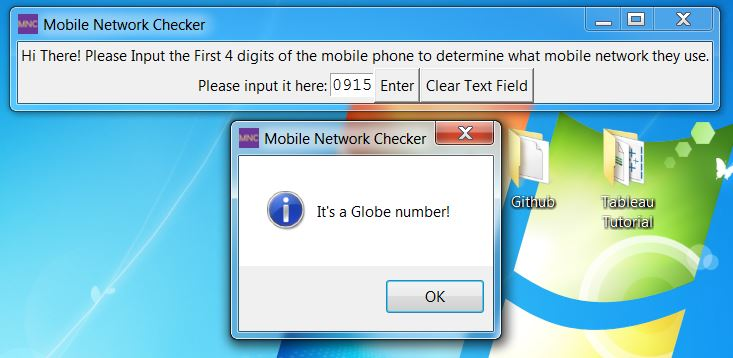

# Mobile-Network-Checker
It checks the prefix mobile number of the User's Input.

Created using Python and the UI with Tkinter Module.

1. Interface
    
    
    This is the Interface of the Program.
  
  
    
  
2. Input

    You can Input any prefix number as long as it is a Philippine Mobile Network Carrier.
    
    

3. Output

    This would be the output of the Program.
    
    
